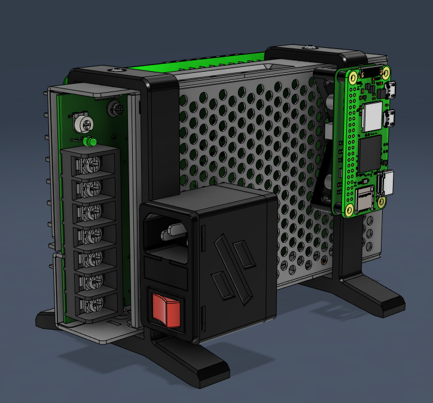

# VØ (_V-Nothing /ˈvinʌθ.ɪŋ/_)
## What is VØ ? 
Simpler to say what it is not.
VØ is not a Voron, it is not a 3D Printer but a collection of 3D printer spare parts put together. Printed parts are minimalistic.



Only few elements are needed to build this wonderful part of technology.
- MORNSUN LMF200-23B24
- IEC320 C14 Inlet  + Fuse + Switch
- BigtreeTech Octopus / Octopus Pro
- Raspberry Pi 2 zero W / 3B+ / 4B

It runs **Moonraker/Danger-Klipper** firmware. Mainboard is configured with USB-to-CAN-bridge Klipper Firmware

## What can I do with it

Almost nothing

## Why ? 
_- Oh ! WTH, a 3D printer that does not print !_<br>
_- Theres many use cases that you do not need an extruder. Why should I use a 3d printer while I own a geetech 3D pen ? ^^_

## Assembly instructions
Put all pieces together, wire as best as you can. BUT BE SERIOUS, ELECTRICITY IS A DANGEROUS THING. 

## Configuration
Install [Raspian](https://www.raspberrypi.com/software/) + [Moonraker](https://github.com/Arksine/moonraker) + [Danger-Klipper](https://github.com/DangerKlippers/danger-klipper).

flash mainboard with USB_to_CAN_bridge firmware

Configure your [Printer.cfg](./printer.cfg) :
```elixir
[mcu]
canbus_uuid: <REPLACE BY you canbus UUID>

[printer]
kinematic: None
```

## Ok, Sound great ! How to get serial for my 3D printer ?
_- THIS IS NOT A 3D PRINTER !_

But to get a serial, you need to have:
- Completed cable management.
- A video of an air print in progress showing the complete VØ, invisible filament can be used.

Your video must show all of the above as well as a view of the complete VØ, or you will be asked to provide those items before receiving a serial.

After validation all requests will receive as serial : **42**

## Aknowledgements
Thanks to the Voron Team to bring us 3D printer that can print.

Big thanks to **#honhonhonbaguette** (the french Voron discord channel) to be so condescending.

